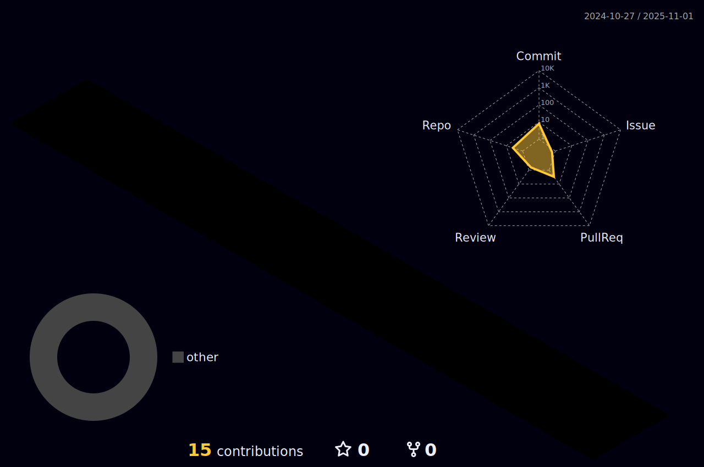

Hi 👋 My name is Filipe Lira Onoue Melo
=============================

FullStack Web Developer
-----------------------

Hi. I'm a Fullstack Web Development. I love breaking my head solving problems and helping the people involved in the process. I always try to keep up to date with technology.

* 🌍  I'm based in São Paulo - SP, Brazil
* 🖥️  See my portfolio at [https://onoue9.github.io/portfolio](https://onoue9.github.io/portfolio)
* ✉️  You can contact me at [filipeflom@gmail.com](mailto:filipeflom@gmail.com)
* 🧠  I'm learning TypeScript, NextJs, NestJs, Docker.
* ⚡  I'm a fanatic for RPG and JRPG style games, where we experience a character's story or even create our own. I have a big dream of being able to develop a game in this style.

### Skills

### Socials

    

### Badges

<b>My GitHub Stats</b>

  

### Support Me

